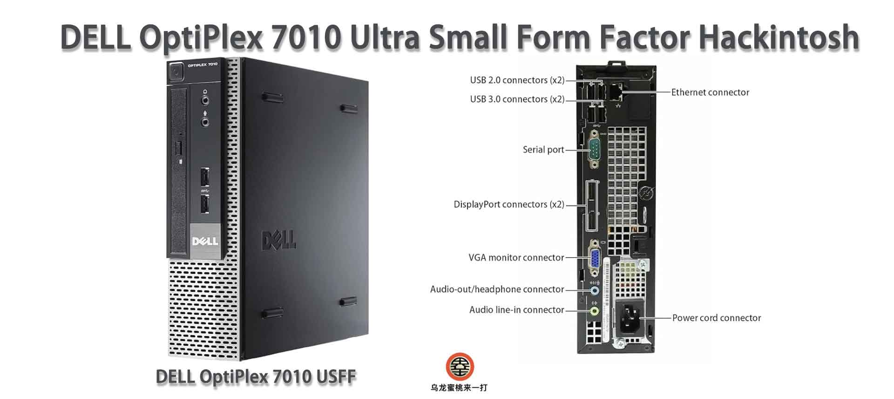

## **[Dell Optiplex 7010 USFF](https://github.com/hackintosh-club/DELL-7010-USFF-OpenCore)  黑苹果 OpenCore EFI**



### [English](README.EN.md)

[OpenCore 1.0.4](https://github.com/acidanthera/OpenCorePkg)

### 可安装系统

- macOS Big Sur 11.x
- macOS Monterey 12.x ( 需要安装KDK 并使用 OCLP 打补丁 )

### 硬件

- 主   板: 戴尔 Q77 Express
- bios版本: A29（06/28/2018）
- 处理器: 英特尔3代  i7-3770  @ 3.40GHz 四核
- 内   存: 英睿达 DDR3L 1600MHz 8GB×2
- 显   卡: 英特尔 HD Graphics 4000
- 硬   盘: XSJ-X100-512GB SATA SSD macOS 12.7.5
- 声   卡: 瑞昱 ALC265
- 网   卡: 英特尔 82579LM
- 无线：Dell Wireless 1705 ( 无法在黑苹果中使用 )

### BIOS设置

```
General
     |-- Boot Sequence：boot List Option -- UEFI
     |-- Advanced Boot Options：Enable Legacy Option ROMs - unCheck  ❎  

System Configuration
	 |-- SATA Operation: AHCI
	 
Video
	 |-- Primary Display: Intel HD Graphics
	 
Security
	 |-- TPM Security - uncheck  ❎  
	 
Secure Boot
	 |-- Secure Boot Enable: Disabled
	 
PowerManagement
	 |-- USB Wake Support: Disabled
	 |-- Block Sleep (S3 State): Check ✅
```

### 注意事项

- 使用[OCAuxiliaryTools](https://github.com/ic005k/OCAuxiliaryTools/releases)生成SMBIOS
- 原机自带无线网卡Dell Wireless 1705 为高通 QCA9565 ，无法在黑苹果中使用
- 必须安装适合Monterey系统的KDK才能使用OCLP打入核显补丁驱动 HD Graphics 4000
- Monterey dmg镜像及KDK下载链接：[点我跳转](https://hackintosh.club/d/10000080)
- 本EFI不支持macOS 13 Ventura 及更高版本

### 联系我们

- QQ群: 23304408

